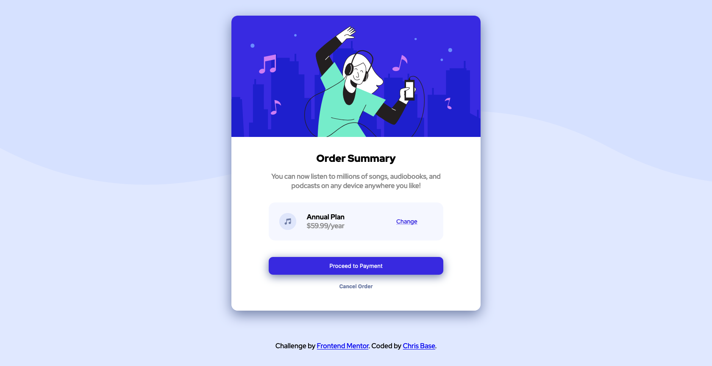

# Frontend Mentor - Order summary card solution

This is a solution to the [Order summary card challenge on Frontend Mentor](https://www.frontendmentor.io/challenges/order-summary-component-QlPmajDUj). Frontend Mentor challenges help you improve your coding skills by building realistic projects. 

## Table of contents

- [Overview](#overview)
  - [The challenge](#the-challenge)
  - [Screenshot](#screenshot)
  - [Links](#links)
  - [Built with](#built-with)
  - [What I learned](#what-i-learned)
- [Author](#author)

## Overview

This challenge was provided by Frontend Mentor and is only used with HTML/CSS/SASS/SCSS and is an order summary of an application.

### The challenge

Users should be able to:

- See hover states for interactive elements

### Screenshot



### Links

- Live Site URL: [Live Site](https://chris-base.github.io/Order-Summary/)
- Solution URL: [My Solution](https://www.frontendmentor.io/solutions/ordersummaryhtmlcssscss-0wLjJXFPt)

### Built with

- Semantic HTML5 markup
- CSS custom properties
- SASS/SCSS
- Flexbox
- CSS Grid
- Mobile-first workflow

### What I learned

This was my first complete project I used Sass/Scss, which was very very helpful in learning about variables and better ways to organize the css. I learned about nesting and how to access certain elements based on their parent, as well as how to nest hover/active styling within the element.

```css
#button-cancel-order {
  &:hover {
		
	}
}
```

## Author

- Website - [Chris Base](https://github.com/chris-base)
- Frontend Mentor - [@chris-base](https://www.frontendmentor.io/profile/chris-base)


